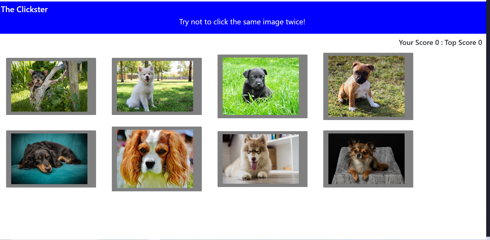

# click-game

In this project, I create a memory game with React with components, manage component state, and respond to user events.

## Getting Started

### Prerequisites

1. HTML
2. CSS
3. Javascript
4. axios 
5. React

## Details of the Project

In this application different images are render to the screen and each image listen for click events. The application also keep track of the user's score. The user's score  increment when clicking an image for the first time. The user's score reset to 0 if the  same image is clicked more than once. Every time an image is clicked, the images rendered to the page after shuffling themselves in a random order. Once the user's score is reset after an incorrect guess, the game restart.

My click-game Website Link ->  (https://preeti1234567.github.io/click-game/)

